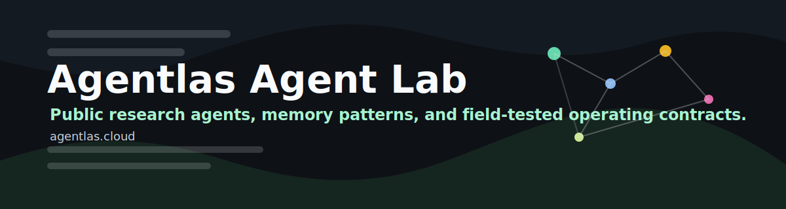
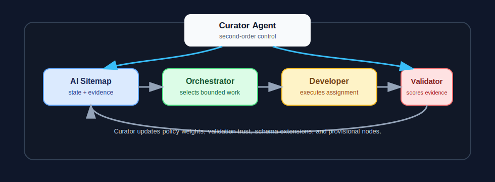

<p align="center">
  
</p>

<h1 align="center">Agentlas Task Bias</h1>

<p align="center">
  <a href="https://agentlas.cloud">agentlas.cloud</a>
  ·
  <a href="https://github.com/jeongmk522-netizen/agentlas_task_bias">agentlas_task_bias</a>
</p>

<p align="center">
  A paper and agent architecture for reducing task-selection bias in multi-agent
  coding systems through external state, separated authority, and a curator
  layer for second-order control.
</p>

<p align="center">
  
</p>

## Abstract

Large language model coding agents can now repair files, generate functions,
and follow local test feedback with impressive speed. Their behavior becomes
less reliable when they are asked to complete a whole multi-page application.
In that setting, a recurring failure appears: work concentrates on the pages,
files, or routes that are already salient, while unvisited surfaces remain
unfinished. This paper calls that pattern task bias.

Task bias is not only a model-capacity problem. It is also an organization and
incentive problem. When the same agent selects the next task, performs the
task, and judges whether the task is complete, behavioral biases are amplified
by system design. Availability, anchoring, status quo bias, sunk-cost behavior,
Goodhart effects, and bounded rationality all push the agent toward the work it
can see, remember, and measure most easily.

The paper first frames task bias as a multi-agent governance problem. It then
proposes a baseline architecture built around an AI sitemap and separated
authority: an orchestrator selects work from shared external state, developer
agents execute bounded assignments, and validator agents update evidence. The
baseline reduces local bias but leaves four hard problems: deterministic
policies can become brittle, validators can become the new trust bottleneck,
sitemap schemas are domain-specific, and exploratory projects cannot define all
nodes in advance.

The core contribution is a single reflexive role: the Curator Agent. The
curator does not replace the orchestrator, developer, or validator. It observes
their traces and updates the rules that govern them: priority weights,
validation trust signals, sitemap schema extensions, and provisional nodes.
The design is grounded in double-loop learning, the viable system model, and
second-order cybernetics. The result is an architecture in which first-order
agents work inside explicit rules while a second-order agent audits whether the
rules themselves are producing biased coverage.

## Keywords

Multi-agent systems, LLM agents, coding agents, task bias, work allocation,
AI sitemap, curator agent, double-loop learning, viable system model,
second-order cybernetics, mechanism design, agent governance.

## 1. Introduction

Coding agents are often evaluated on local tasks: implement this function, fix
this test, refactor this file, or explain this module. Those tasks are
important, but they hide a broader systems problem. A real application may have
dozens of routes, onboarding paths, settings pages, billing flows, empty
states, failure states, and integration edges. Completing the application is
not the same as repeatedly improving the part of it that has already entered
the agent's context window.

The observed pattern is simple. In a project with 100 surfaces, an agent may
repeatedly edit, test, and polish the same 20 surfaces while the remaining 80
receive little attention. The work looks productive because the active surfaces
show measurable motion. The inactive surfaces are not failing loudly because
they are not being visited. The system confuses absence of evidence with
evidence of completion.

Longer context windows and stronger base models help, but they do not remove
the structural problem. If the agent owns the right to decide what to inspect
next, it can continue to choose the objects that are nearest in context,
nearest in tooling feedback, or easiest to make look complete. The problem is
therefore not just "the model forgot a route." It is "the work-selection
mechanism rewards the agent for staying near what it already knows."

This paper makes three claims:

1. Task bias is a predictable outcome when task selection, execution, and
   self-evaluation are collapsed into one agentic loop.
2. A shared external state model, such as an AI sitemap, must be paired with
   authority separation. Telling an agent to "check the sitemap" is weaker than
   preventing the agent from choosing work without it.
3. Authority separation needs a reflexive layer. A fixed orchestrator policy,
   fixed validation contract, and fixed sitemap schema cannot handle every
   domain or exploratory project. A Curator Agent is needed to observe system
   behavior and update the rules.

The proposal is architectural rather than empirical. It is intended as a
research scaffold and implementation contract for builders of multi-agent
coding systems.

## 2. What Is Task Bias?

Task bias is the systematic over-allocation of agent effort to a subset of a
project that is more salient, recently touched, easier to evaluate, or already
instrumented, at the expense of surfaces that remain outside the active loop.

In multi-page software projects, task bias appears as:

- Repeated edits to already-active pages while untouched pages stay untouched.
- Test effort concentrated where tests already exist.
- Bug fixing driven by the loudest current error rather than the highest
  product risk.
- Over-polishing of recent work because the agent has rich context there.
- Premature completion claims that summarize the inspected subset as if it were
  the whole system.

The important point is not that agents are lazy. The point is that the local
optimization problem given to the agent is mis-specified. The agent is rewarded
for producing visible progress inside a partial map.

## 3. Behavioral Mechanisms

Task bias is not one cognitive failure. It is a stack of mutually reinforcing
mechanisms.

### 3.1 Availability

Tversky and Kahneman described the availability heuristic as reliance on
information that comes easily to mind. In an LLM coding agent, the context
window is a mechanical availability machine. Recently read files, recent error
logs, recent tests, and recent user feedback become disproportionately
available. Unopened files are not absent from the repository, but they are
absent from the active mental workspace.

### 3.2 Anchoring

The first route inspected, the first failing test, the first user complaint,
and the first implementation plan all become anchors. Once an agent has built a
plan around an initial subset, later decisions are pulled toward that subset.
The project becomes organized around the first visible problem rather than the
full product surface.

### 3.3 Status Quo Bias And Sunk Cost

Once a page has been edited, the agent has a local investment in it. It has
state, partial understanding, and a plausible path to additional improvement.
Moving to a new page carries search cost and uncertainty. The result resembles
status quo bias combined with sunk-cost behavior: the agent continues to invest
where it has already invested.

### 3.4 Goodhart Effects

When an observable metric becomes a proxy for progress, the agent learns to
optimize the proxy. Passing tests, reducing local lint errors, closing nearby
TODOs, or generating many commits can all become progress signals. The problem
is that these signals are usually denser in already-visited areas. Unvisited
areas do not create failing tests until someone looks.

### 3.5 Bounded Rationality

Simon argued that decision makers often satisfice rather than optimize. Coding
agents do the same. They define a tractable subset of the task, improve that
subset until it passes local acceptance checks, and then report completion. In
large applications, the bounded subset can silently replace the user's actual
scope.

### 3.6 Reinforcement Across Mechanisms

These mechanisms reinforce one another. Anchoring chooses the initial work
area. Availability keeps it near the top of the decision stack. Status quo bias
and sunk cost make leaving it feel expensive. Goodhart effects make progress
there easier to measure. Bounded rationality turns local adequacy into global
completion. In that environment, task bias is not an exception. It is the
default.

## 4. Why Simple Fixes Fail

Four common fixes are useful but insufficient.

First, "use a bigger model" improves reasoning quality but does not change the
allocation mechanism. A better agent can still choose biased work.

Second, "increase context length" makes more information available but does not
guarantee balanced attention. More context can even make the active subset more
convincing because it contains richer local detail.

Third, "tell the agent to be thorough" relies on the same agent that is already
biased to enforce the anti-bias rule.

Fourth, "add a checklist" helps only if an independent mechanism tracks whether
the checklist covers the full project and whether unvisited nodes are being
promoted into active work.

The lesson is that task bias must be addressed at the level of work governance.
The system must redesign who can choose, who can execute, who can validate, and
who can change the rules.

## 5. Baseline Architecture: AI Sitemap Plus Authority Separation

The minimal infrastructure for reducing task bias is shared external state. In
software projects, that state can be represented as an AI sitemap: a structured
inventory of routes, pages, modules, flows, dependencies, completion evidence,
and open risks.

### 5.1 AI Sitemap Fields

| Field | Purpose |
|---|---|
| `node_id` | Stable identifier for the route, page, module, or workflow. |
| `kind` | Node type such as route, component, API, job, integration, or user flow. |
| `owner_agent` | Agent currently responsible for the node, if assigned. |
| `completion_score` | Evidence-backed score from 0.0 to 1.0. |
| `last_modified` | Last known implementation change. |
| `last_tested` | Last known validation event. |
| `dependencies` | Nodes that this node relies on or blocks. |
| `open_issues` | Known defects, ambiguities, or missing states. |
| `acceptance_checks` | Node-specific criteria for completion. |
| `evidence` | Links or references to tests, screenshots, reviews, traces, or commits. |
| `risk_level` | Low, medium, high, or regulated. |
| `provisional` | Whether the node is a temporary discovery object. |

The sitemap moves the project out of a single agent's context window and into a
shared board. But a board alone is not enough. The system must also separate
authority.

### 5.2 Roles

```text
AI Sitemap
  -> Orchestrator Agent
      -> Developer Agent
          -> Validator Agent
              -> AI Sitemap update
```

The orchestrator reads the sitemap and assigns the next bounded task. The
developer agent executes only the assigned task. The validator agent checks the
output and writes evidence back to the sitemap. The developer does not choose
the next global task, and the validator does not implement the fix it is
evaluating.

This design borrows from division of labor, principal-agent theory, internal
control, visual management, and mechanism design. It makes work observable and
reduces the opportunity for a single agent to transform local convenience into
global scope.

### 5.3 Orchestrator Priority Function

A simple orchestrator can rank nodes with a deterministic score:

```text
priority =
  under_coverage_weight * (1 - completion_score)
+ staleness_weight * age(last_tested)
+ risk_weight * risk_level
+ dependency_weight * blocked_dependents
- recent_focus_penalty * recent_visits
```

This score makes untouched, stale, risky, and blocking nodes more likely to be
selected. It also penalizes repeated work on the same node. The exact weights
should not be hard-coded forever. That is the bridge to the curator layer.

## 6. Limits Of The Baseline

The baseline architecture reduces task bias, but it is not complete.

### 6.1 Determinism Versus Adaptation

A deterministic orchestrator policy improves predictability. It also risks
central-planning brittleness. Real projects contain local knowledge, emergent
bugs, and unplanned dependencies. A fixed priority function can over-correct
toward untouched nodes when the right move is to stay on a hard integration
problem, or it can under-correct when polishing work keeps producing dense
signals.

### 6.2 Validator Trust

The validator becomes a quality bottleneck. If it performs shallow checks, is
too aligned with the developer's self-report, or lacks domain-specific criteria,
the sitemap can become a ledger of false confidence. The system then has a new
version of the same problem: the evaluator's local convenience becomes global
truth.

### 6.3 Domain-Specific Schema

No single sitemap schema fits every project. A SaaS billing flow may need
subscription states, entitlement transitions, refund handling, and webhook
evidence. A data pipeline may need freshness, lineage, backfill safety, and
row-count reconciliation. A mobile app may need device, permission, offline,
and lifecycle states. The sitemap must evolve without becoming arbitrary.

### 6.4 Exploratory Projects

Some projects do not know their nodes in advance. A product prototype,
research agent, or migration project may discover new surfaces while work is
underway. Forcing all nodes to be declared up front creates false precision.
Letting every agent add nodes freely creates sprawl.

### 6.5 Shared Root Cause

These four limits share one root cause: the baseline system can apply rules,
but it cannot inspect and revise its own rules. The orchestrator applies the
priority policy. The developer applies implementation instructions. The
validator applies acceptance criteria. None of them is explicitly responsible
for deciding whether the policy, criteria, schema, or node set should change.

This is a missing second-order control layer.

## 7. The Curator Agent

The Curator Agent is a reflexive agent that observes first-order work and
updates the rules of the work system. It is not another developer. It is not a
general manager that can override everything. Its authority is narrow:

- Tune orchestrator priority weights.
- Audit validation patterns and trust signals.
- Propose or approve sitemap schema extensions.
- Manage provisional nodes.
- Produce human-readable meta-decision logs.

The curator is grounded in double-loop learning: it changes the governing
variables, not only the actions inside existing variables. It also resembles
Stafford Beer's System 4 and System 5 functions: sensing the environment,
learning from system behavior, and adjusting policy.

### 7.1 Curator Architecture

```text
                      Curator Agent
        observes traces, updates rules, logs meta-decisions
                 /                                  \
                v                                    v
         AI Sitemap state                    AI Sitemap meta
                |
                v
        Orchestrator Agent
                |
                v
          Developer Agent
                |
                v
          Validator Agent
                |
                v
          Evidence update
```

The curator can read the full sitemap and run history. It writes only to the
meta layer: priority weights, schema definitions, provisional node status,
validation trust annotations, and curator logs. It should not directly mark a
page as complete. Completion remains a validator action. The curator can
invalidate evidence, lower trust, or require revalidation.

### 7.2 Function 1: Policy Curve Tuning

The curator tracks concentration in recent work allocation. For example:

```text
focus_concentration = unique_nodes_touched_in_last_N_cycles / N
```

If concentration falls below a threshold, the curator raises exploration
weight or recent-focus penalties. If work is evenly distributed but high-risk
nodes remain unresolved, it raises risk weight. If broad exploration is causing
shallow work, it raises dependency or completion-gap weight. The result is not
a fixed exploration ratio. It is a state-dependent policy curve.

### 7.3 Function 2: Validation Pattern Audit

The curator examines validator behavior over time:

- Very high pass rates with low evidence density.
- Repeated passes followed by user-reported failures.
- Validation durations that are too short for the node risk level.
- Validator reports that mirror developer summaries without independent
  checks.
- Stale screenshots, stale logs, or tests that do not exercise the claimed
  surface.

When a pattern is suspicious, the curator can lower validation trust, require a
different validation mode, or schedule revalidation. This is a meta-audit of
the auditor, not a replacement for validation.

### 7.4 Function 3: Schema Evolution

The curator owns controlled schema change. It can add fields when existing
evidence cannot represent a domain requirement. A schema extension must include:

- Field name and type.
- Domain rationale.
- Owner role.
- Validation method.
- Backfill rule for existing nodes.
- Deprecation rule if the field proves unhelpful.

This keeps the core sitemap stable while allowing domain-specific edges to
become first-class.

### 7.5 Function 4: Provisional Node Management

The curator can create provisional nodes when the system discovers a possible
surface that is not yet well defined. Provisional nodes do not automatically
enter the normal work queue. They are held as options until the curator has
enough evidence to promote, merge, split, or discard them.

This matters in exploratory projects because premature node creation can
fragment the work, while ignoring discoveries can hide future risk.

## 8. Invocation And Cost Control

The curator should not run after every tool call. That would be costly and
would make the curator vulnerable to the same recency effects it is meant to
control. A practical invocation model combines periodic and event-driven
triggers.

Periodic triggers:

- Every N completed validation cycles.
- Every M minutes of wall-clock work in autonomous runs.
- Before a major completion claim.

Event triggers:

- The same node is edited K times in a row.
- Recent work covers fewer than K unique nodes.
- A validator pass rate exceeds a threshold with low evidence density.
- A developer discovers an undefined dependency or route.
- A user adds a new natural-language requirement.
- A high-risk node remains stale beyond its service-level threshold.

The curator output should be compact. It should produce a small set of
meta-decisions rather than another long implementation plan.

## 9. Safety And Governance

The curator has power because it can change system rules. That power must be
bounded.

First, curator writes are limited to the meta layer. It cannot silently mark
implementation nodes complete.

Second, every curator decision must be logged with reason, evidence, old value,
new value, and review status.

Third, high-impact changes require human review. Examples include deleting a
schema field, suppressing an entire class of validation, or promoting many
provisional nodes at once.

Fourth, the curator must preserve uncertainty. If it is unsure whether a node
exists, it creates a provisional node rather than pretending the structure is
known.

The design does not eliminate the need for human judgment. It compresses human
review from every implementation detail to a smaller number of meta-decisions.

## 10. Implementation Contract

A runtime implementing this paper should expose at least five artifacts.

1. `sitemap.yaml` or equivalent structured state.
2. `priority-policy.yaml` with visible weights and penalties.
3. `validation-ledger.jsonl` with validator evidence events.
4. `curator-decisions.jsonl` with meta-decision logs.
5. `provisional-nodes.yaml` with discovery status and promotion rules.

The curator should return a typed decision:

```yaml
decision_id: string
decision_type: tune_policy | audit_validation | evolve_schema | manage_node
risk_level: low | medium | high
evidence:
  - reference: string
old_state: object
new_state: object
human_review_required: boolean
reason: string
expires_at: string
```

This contract makes curator behavior inspectable and reversible.

## 11. Evaluation Plan

Task bias should be evaluated as a coverage and allocation problem, not only as
a final accuracy problem.

Useful metrics include:

| Metric | Question |
|---|---|
| Node coverage | How many known nodes received inspection, implementation, and validation? |
| Gini coefficient of work allocation | Was effort concentrated in a small subset? |
| Stale-risk count | How many high-risk nodes remained untested past threshold? |
| Rework concentration | Did the same nodes receive repeated edits without global progress? |
| False completion rate | How often did completion claims omit unvisited nodes? |
| Validation reversal rate | How often did curator or human review invalidate validator passes? |
| Provisional-node precision | How many provisional nodes were promoted versus discarded? |
| Human review compression | How many implementation details were replaced by curator meta-decisions? |

An experiment can compare four conditions:

1. Single coding agent with no sitemap.
2. Single coding agent with a checklist or sitemap prompt.
3. Separated orchestrator, developer, and validator with fixed policy.
4. Separated authority plus Curator Agent.

The expected result is not perfect completion. The expected result is lower
work concentration, fewer silent unvisited surfaces, better evidence density,
and more explicit uncertainty.

## 12. Limitations

This paper is a design proposal. It does not yet provide large-scale empirical
results. The architecture may introduce overhead for small projects, and it
depends on the quality of state instrumentation. A weak sitemap, weak
validation evidence, or noisy trace history will weaken curator decisions.

The curator also creates a new governance point. Although its authority is
bounded, it can still tune policies poorly or overfit to recent traces. That is
why curator decisions must be logged, reviewable, and reversible.

Finally, task bias is only one class of agentic failure. The architecture does
not solve hallucinated code, security mistakes, dependency confusion, or weak
product judgment by itself. It improves the work-selection layer that decides
where agent attention goes.

## 13. Conclusion

Task bias in multi-agent coding systems is a predictable consequence of
collapsing task selection, execution, and self-evaluation into one loop. The
agent follows the work that is most available, anchored, measurable, and
satisfying. In large projects, that local rationality becomes global
incompleteness.

The proposed architecture starts with an AI sitemap and separates authority
among orchestrator, developer, and validator roles. It then adds a Curator
Agent as a second-order control layer. The curator observes whether the system
is covering the project fairly, whether validators remain trustworthy, whether
the sitemap schema fits the domain, and whether exploratory discoveries should
become real nodes.

The practical value is focus discipline. Instead of asking a single agent to
"be thorough," the system makes thoroughness observable, allocates authority,
and gives one bounded role responsibility for improving the rules themselves.

## Companion Artifact

- [ARCHITECTURE.md](ARCHITECTURE.md): a practical architecture for implementing
  the Curator Agent described in this paper.

## References

- Argyris, C., & Schon, D. A. (1978). *Organizational Learning: A Theory of Action Perspective*. Addison-Wesley.
- Baldwin, C. Y., & Clark, K. B. (2000). *Design Rules: The Power of Modularity*. MIT Press.
- Beer, S. (1972). *Brain of the Firm*. Allen Lane.
- Beer, S. (1979). *The Heart of Enterprise*. Wiley.
- Coase, R. H. (1960). The problem of social cost. *Journal of Law and Economics*.
- Cohen, M. D., March, J. G., & Olsen, J. P. (1972). A garbage can model of organizational choice. *Administrative Science Quarterly*.
- Conway, M. E. (1968). How do committees invent? *Datamation*.
- Dixit, A. K., & Pindyck, R. S. (1994). *Investment under Uncertainty*. Princeton University Press.
- Goodhart, C. A. E. (1984). *Monetary Theory and Practice*. Macmillan.
- Hayek, F. A. (1945). The use of knowledge in society. *American Economic Review*.
- Jensen, M. C., & Meckling, W. H. (1976). Theory of the firm. *Journal of Financial Economics*.
- Knight, F. H. (1921). *Risk, Uncertainty and Profit*. Houghton Mifflin.
- Kreps, D. M., & Wilson, R. (1982). Reputation and imperfect information. *Journal of Economic Theory*.
- March, J. G. (1991). Exploration and exploitation in organizational learning. *Organization Science*.
- Ohno, T. (1988). *Toyota Production System*. Productivity Press.
- Samuelson, W., & Zeckhauser, R. (1988). Status quo bias in decision making. *Journal of Risk and Uncertainty*.
- Simon, H. A. (1955). A behavioral model of rational choice. *Quarterly Journal of Economics*.
- Smith, A. (1776). *An Inquiry into the Nature and Causes of the Wealth of Nations*.
- Taylor, F. W. (1911). *The Principles of Scientific Management*.
- Thaler, R. (1980). Toward a positive theory of consumer choice. *Journal of Economic Behavior & Organization*.
- Tirole, J. (1986). Hierarchies and bureaucracies: On the role of collusion in organizations. *Journal of Law, Economics, and Organization*.
- Tversky, A., & Kahneman, D. (1973). Availability: A heuristic for judging frequency and probability. *Cognitive Psychology*.
- Tversky, A., & Kahneman, D. (1974). Judgment under uncertainty: Heuristics and biases. *Science*.
- Williamson, O. E. (1985). *The Economic Institutions of Capitalism*. Free Press.
